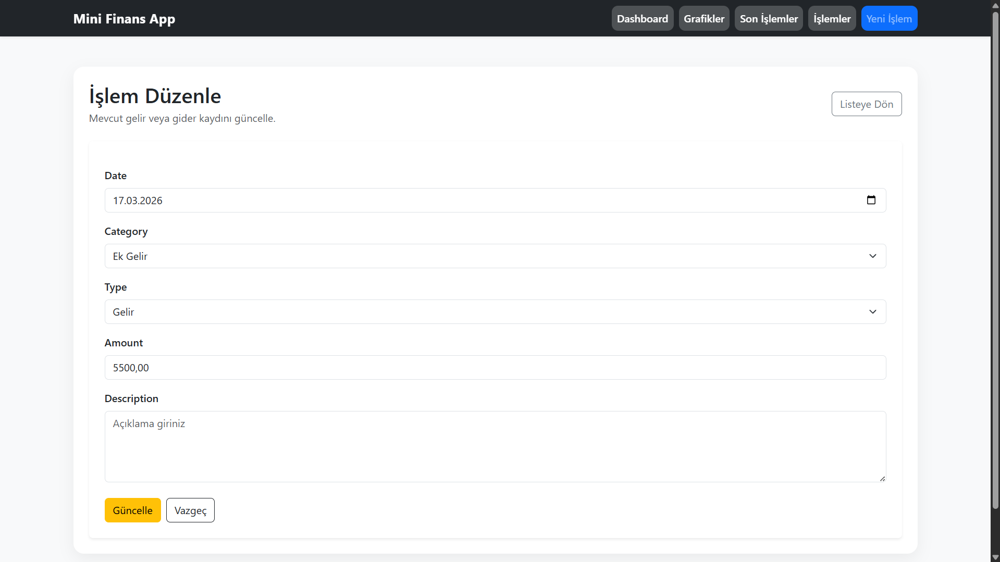

# Mini Finans Raporlama

Mini Finans Raporlama, **ASP.NET MVC ve Entity Framework** kullanılarak geliştirilmiş basit ve kullanıcı dostu bir **finans takip uygulamasıdır**.  
Kullanıcılar gelir ve gider işlemlerini ekleyebilir, düzenleyebilir, silebilir ve finansal durumlarını grafikler üzerinden analiz edebilir.

Bu proje, **CRUD işlemleri, veri görselleştirme, filtreleme ve log sistemi** gibi temel backend yeteneklerini göstermek amacıyla geliştirilmiştir.

---

# Özellikler

• Gelir ve gider işlemleri ekleme  
• İşlem düzenleme ve silme  
• Dashboard finans özeti  
• Grafikler ile veri görselleştirme  
• Kategori bazlı gider analizi  
• Tarih ve kategori filtreleme  
• İşlem log sistemi  
• Responsive arayüz  

---

# Kullanılan Teknolojiler

Backend

- ASP.NET MVC
- C#
- Entity Framework
- SQL Server

Frontend

- Bootstrap 5
- Chart.js
- SweetAlert2

---

# Dashboard Özellikleri

Dashboard ekranında kullanıcılar:

- Toplam gelir
- Toplam gider
- Net bakiye
- Toplam işlem sayısı

gibi finansal özet bilgileri görüntüleyebilir.

Ayrıca:

- Gelir / Gider dağılım grafiği
- Kategori bazlı gider grafiği

gibi veri görselleştirme araçları bulunmaktadır.

---

# Veritabanı

Projede kullanılan veritabanı yapısı **Database klasöründe** bulunmaktadır.

Database/MiniFinansRaporlama_DB.sql

Script aşağıdaki tabloları oluşturur:

- Transactions
- Logs

Transactions tablosu finans işlemlerini saklar.  
Logs tablosu ise sistemde yapılan işlemleri kayıt altına alır.

---

# Kurulum

Projeyi çalıştırmak için aşağıdaki adımları takip edebilirsiniz.

### 1. SQL Server'da veritabanı oluştur

MiniFinansDB

### 2. Database scriptini çalıştır

Database/MiniFinansRaporlama_DB.sql

### 3. Web.config dosyasını düzenle

Connection string içindeki server adını kendi bilgisayarınıza göre değiştirin.

Örnek:

data source=YOUR_SERVER_NAME

veya

data source=.

### 4. Projeyi çalıştır

Visual Studio ile projeyi açıp çalıştırabilirsiniz.

---

## Ekran Görüntüleri

| Dashboard Overview | Dashboard Charts |
|-------------------|------------------|
|  |  |

| Create Transaction | Edit Transaction |
|-------------------|------------------|
|  |  |

| Transaction Details | Delete Transaction |
|--------------------|--------------------|
|  |  |

---

# Proje Yapısı

MiniFinansRaporlama
│
├── Controllers
├── Models
├── Views
├── Database
│ └── MiniFinansRaporlama_DB.sql
│
├── Screenshots
│
├── README.md
├── Web.config

---

# Amaç

Bu proje aşağıdaki konularda pratik yapmak amacıyla geliştirilmiştir:

- ASP.NET MVC mimarisi
- Entity Framework kullanımı
- CRUD işlemleri
- Dashboard tasarımı
- Veri görselleştirme
- Filtreleme işlemleri
- Log sistemi oluşturma

---

# Geliştirici

Mertcan Kayırıcı

Hitit Üniversitesi  
Bilgisayar Programcılığı