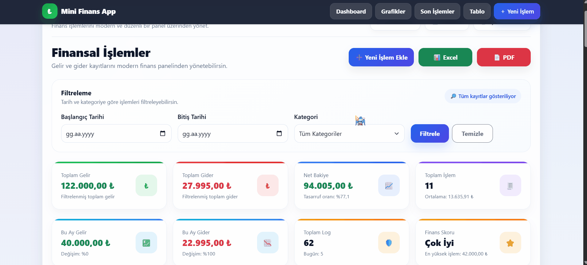
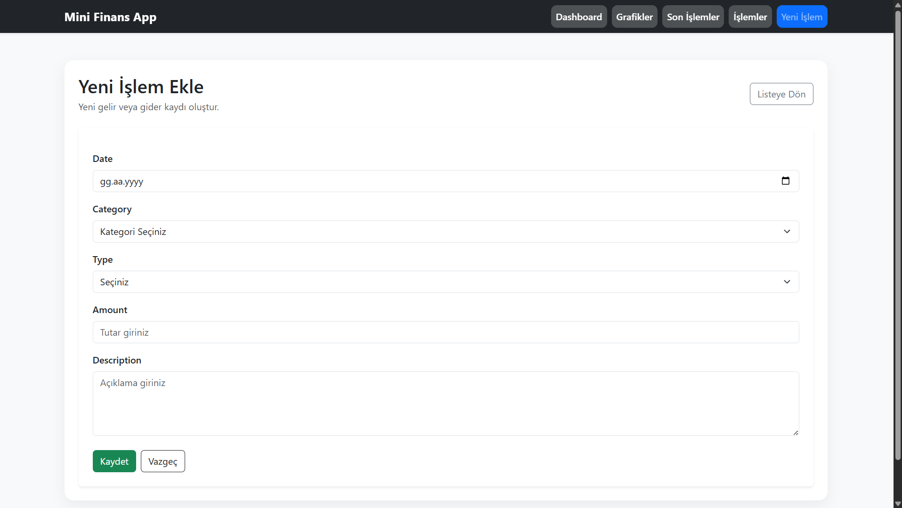
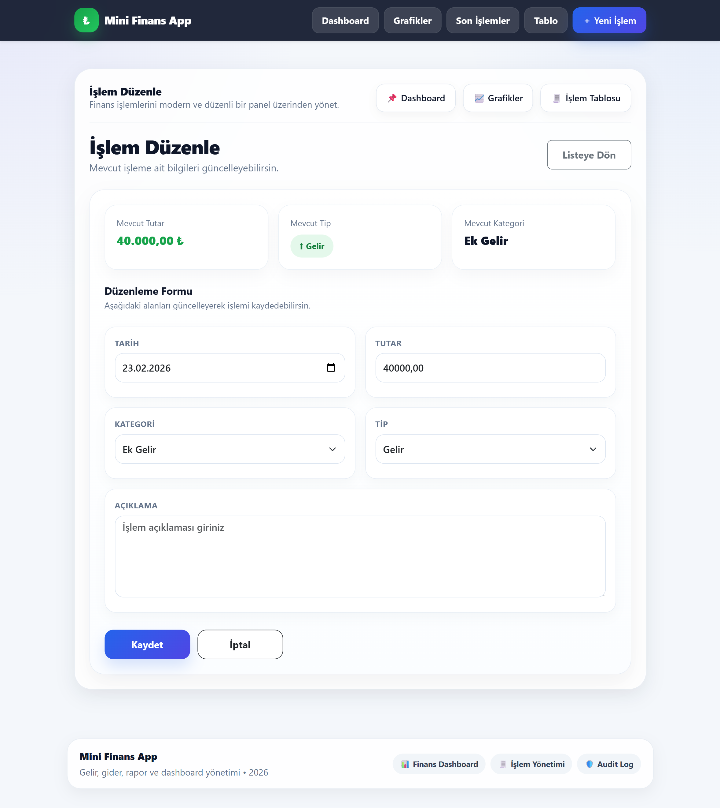
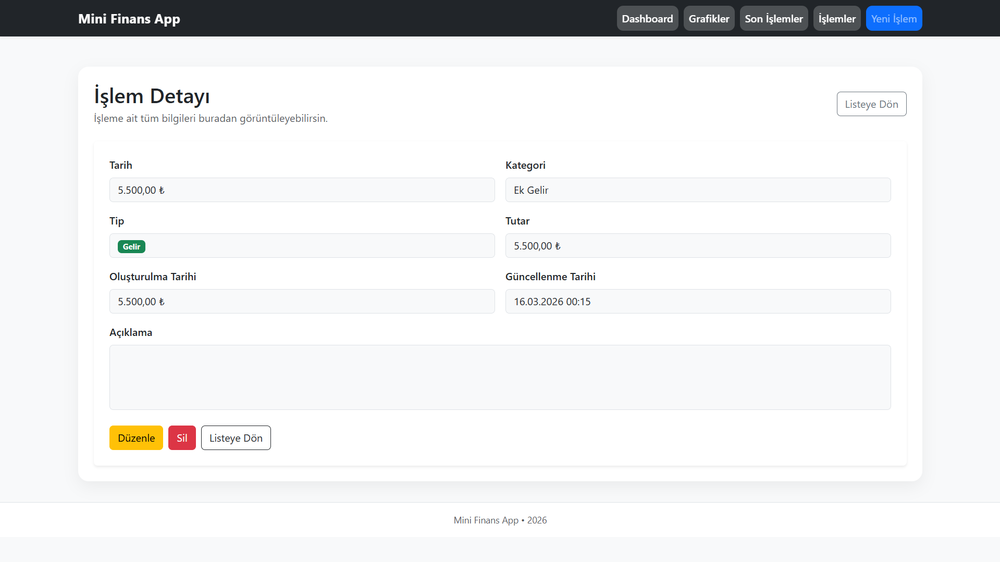
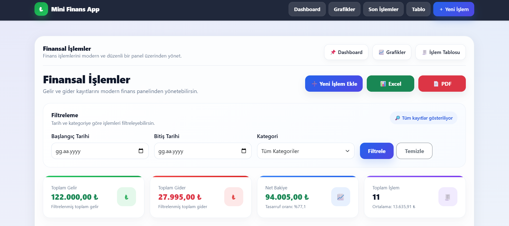
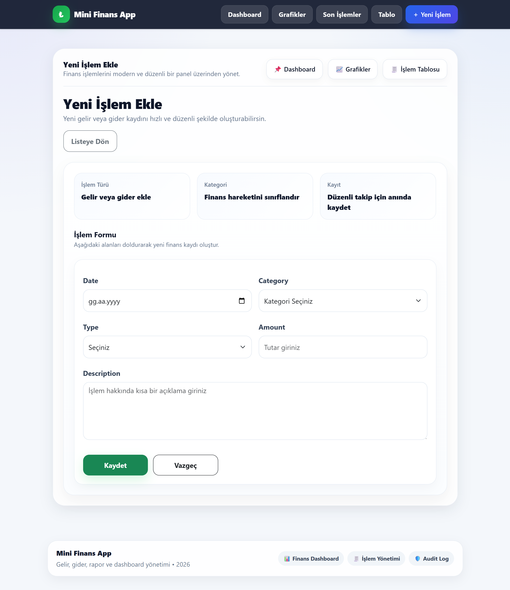
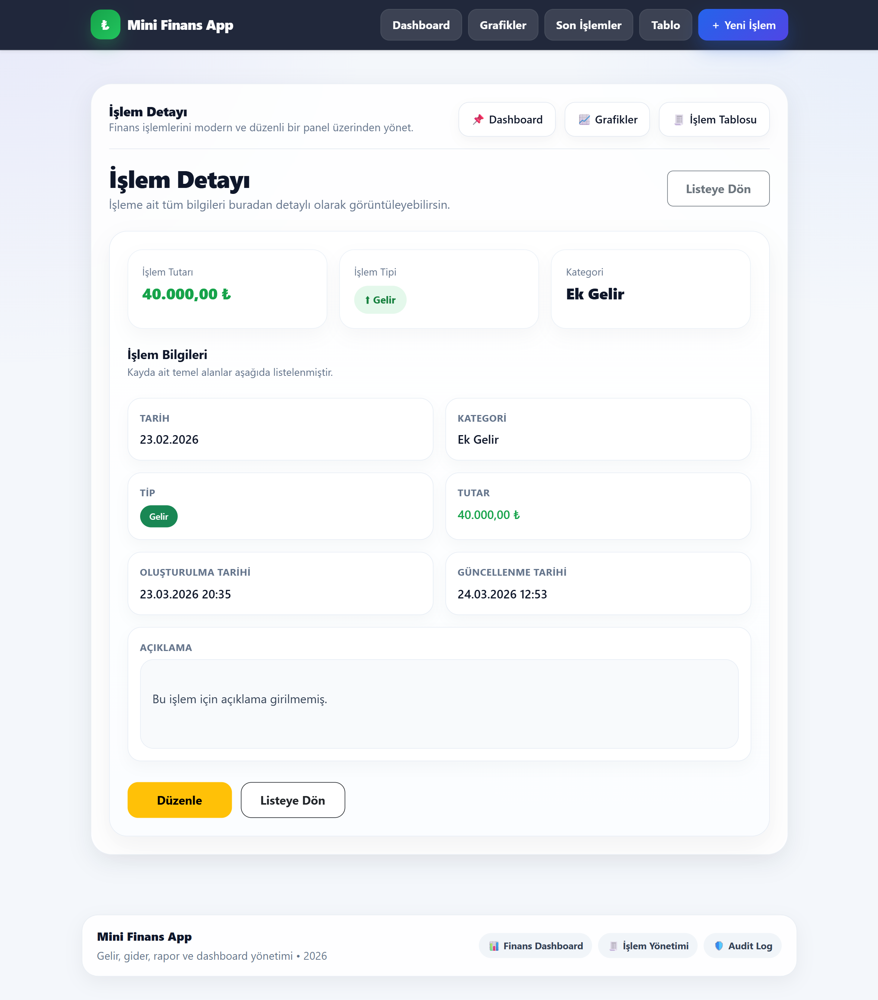

# 💰 Mini Financial Reporting System

<p align="center">

  
  
  
  
  
  

</p>

---

A modern and dynamic **financial tracking web application** built with **ASP.NET MVC, Entity Framework, and SQL Server**.

This project provides a complete system for managing financial transactions with a **modern dashboard, export system, and audit logging**.

---

# 🎬 Demo

| Dashboard |
|------------|
|  |

| Export | Filter |
|--------|--------|
|  |  |

---

# 🔄 UI Evolution (Before vs After)

## 📊 Dashboard

| Before | After |
|--------|------|
|  |  |

---

## 💸 Transaction Pages

| Create | Edit |
|--------|------|
|  |  |

| Details | Delete |
|--------|--------|
|  |  |

---

# ✨ Features

## 💸 Financial Management
- Full CRUD operations (Create, Edit, Delete, Details)
- Income & Expense tracking
- Category-based system
- Date-based filtering

---

## 📊 Dashboard & Analytics
- Real-time financial summary
- Income / Expense cards
- Category distribution charts
- Chart.js integration
- Monthly financial overview

---

## 📁 Export System (NEW 🚀)
- Export to Excel
- Export to PDF
- Filter-based export
- Clean report formatting

---

## 📝 Audit Log System (NEW 🚀)
- Tracks Create / Update / Delete actions
- Stores timestamps
- Logs user operations
- Improves system transparency

---

## 🎨 UI / UX Improvements (NEW 🚀)
- Redesigned Edit / Create / Details pages
- Modern card-based UI
- Better form usability
- SweetAlert confirmations
- Responsive layout

---

# 📸 Screenshots

| Dashboard |
|----------|
|  |

| Create | Edit |
|--------|------|
|  |  |

| Details |
|--------|
|  |

---

# 🧠 Database Design


---

# 🚀 Key Highlights

- Modern financial dashboard  
- Export system (Excel & PDF)  
- Audit logging system  
- Advanced filtering  
- Clean UI/UX  
- Scalable architecture  

---

# 🛠️ Tech Stack

- ASP.NET MVC (.NET Framework)
- Entity Framework
- SQL Server
- Bootstrap 5
- Chart.js
- SweetAlert2
- iText7 (PDF)
- ClosedXML (Excel)

---

# ⚙️ Installation

### Clone
```bash
git clone https://github.com/MertcanKayirici/MiniFinansRaporlama.git
```
### 2. Open the project

Open the `.sln` file using Visual Studio

### 3. Create database

Create a database named:
```plain
MiniFinansDB
```
### 4. Run SQL script

Execute:
```bash
Database/MiniFinansRaporlama_DB.sql
```
### 5. Configure connection string

Update your Web.config:
```xml
<connectionStrings>
  <add name="MiniFinansDb"
       connectionString="Data Source=YOUR_SERVER_NAME;Initial Catalog=MiniFinansDB;Integrated Security=True"
       providerName="System.Data.SqlClient" />
</connectionStrings>
```
> ⚠️ Make sure to replace `YOUR_SERVER_NAME` with your SQL Server instance name.

### 6. Run the project

Run the project using **Visual Studio (F5)** 🚀

---

## 📌 Important Notes
- Ensure SQL Server is running
- Update the connection string before running
- Do not share sensitive credentials

---

## 📂 Project Structure
Controllers   → MVC Controllers  
Models        → Entity Framework Models  
Views         → Razor Views  
Database      → SQL Scripts  
Screenshots   → Images & GIF files

---

## 👨‍💻 Developer

Mertcan Kayırıcı

Backend-focused Full Stack Developer
ASP.NET MVC & SQL Server

---

## ⭐ Project Purpose

This project was developed to simulate a real-world financial tracking system, focusing on:

- Clean architecture principles
- Data visualization
- Scalable backend design
- Modern UI/UX experience 

---
