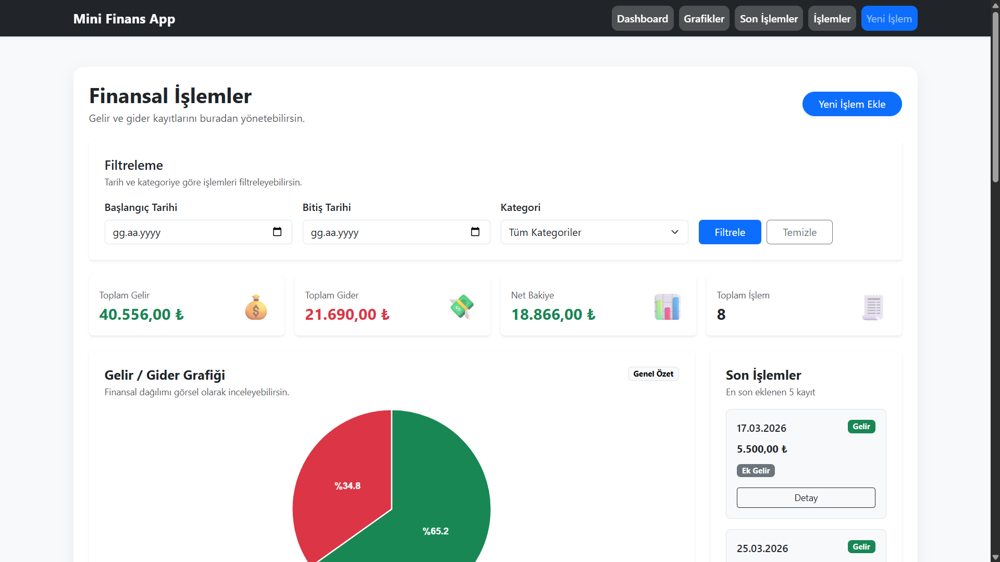
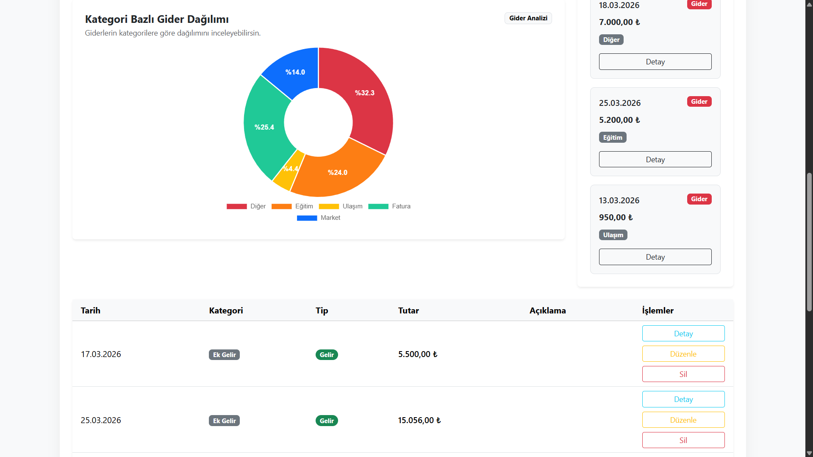
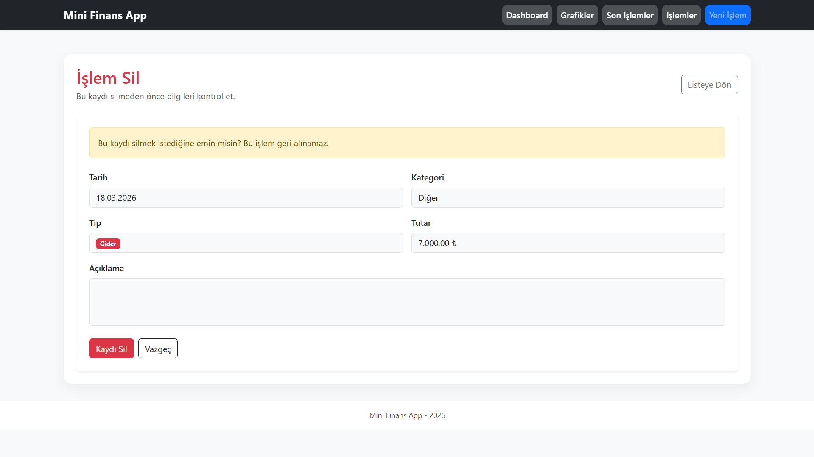
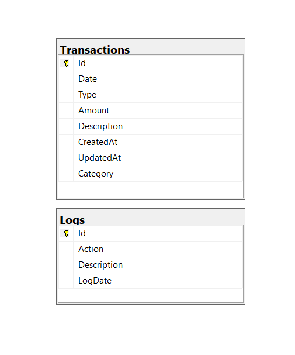

# Mini Finans Raporlama

A simple **financial tracking web application** built with **ASP.NET MVC, Entity Framework and SQL Server**.  
The application allows users to manage income and expense transactions and visualize financial data through dashboards and charts.

This project demonstrates backend development concepts such as **CRUD operations, database design, filtering, logging systems, and data visualization**.

---

# Features

- Create, update and delete financial transactions
- Dashboard overview with financial summary
- Income / Expense visual analytics
- Category based expense analysis
- Date and category filtering
- Transaction logging system
- Responsive user interface
- Chart-based data visualization

---

# Technologies Used

### Backend

- ASP.NET MVC
- C#
- Entity Framework
- SQL Server
- LINQ

### Frontend

- Bootstrap 5
- Chart.js
- SweetAlert2
- Razor View Engine

---

# Application Architecture

This project follows the **ASP.NET MVC architecture pattern**.

### Controllers
Handle incoming HTTP requests and control application flow.

### Models
Represent database entities and business data.

### Views
Provide the user interface using Razor templates.

### Entity Framework
Used as ORM (Object Relational Mapper) for database communication.

This layered structure improves **code organization, maintainability, and separation of concerns**.

---

# Dashboard Features

The dashboard provides a financial overview including:

- Total income
- Total expenses
- Net balance
- Transaction count

It also includes visual data analysis:

- Income / Expense distribution chart
- Category based expense chart

---

# Screenshots

| Dashboard Overview | Dashboard Charts |
|-------------------|------------------|
|  |  |

| Create Transaction | Edit Transaction |
|-------------------|------------------|
|  |  |

| Transaction Details | Delete Transaction |
|--------------------|--------------------|
|  |  |

---

# Database Schema

The project uses a simple relational database structure.

### Transactions

| Column | Description |
|------|-------------|
| Id | Primary key |
| Date | Transaction date |
| Type | Income or Expense |
| Category | Transaction category |
| Amount | Transaction amount |
| Description | Transaction description |
| CreatedAt | Creation timestamp |
| UpdatedAt | Last update timestamp |

### Logs

| Column | Description |
|------|-------------|
| Id | Primary key |
| Action | Performed action |
| Description | Log description |
| LogDate | Log timestamp |

---

# ER Diagram

Database entity relationship overview:



---

# Database Script

The SQL script required to create the database structure is located in:


Database/MiniFinansRaporlama_DB.sql


This script creates the following tables:

- Transactions
- Logs

---

# Installation

### 1 Clone the repository


git clone https://github.com/MertcanKayirici/MiniFinansRaporlama.git


### 2 Open with Visual Studio

Open the project solution in **Visual Studio**.

### 3 Create database

Create a new database in SQL Server:


MiniFinansDB


### 4 Run database script

Execute the SQL script:


Database/MiniFinansRaporlama_DB.sql


### 5 Configure connection string

Update the **Web.config** connection string with your SQL Server name:


data source=YOUR_SERVER_NAME


Example:


data source=.


### 6 Run the project

Run the project from Visual Studio.

---

# Project Structure


MiniFinansRaporlama
│
├── Controllers
├── Models
├── Views
│
├── Database
│ └── MiniFinansRaporlama_DB.sql
│
├── Screenshots
│
├── README.md
├── Web.config


---

# Learning Goals

This project was developed to practice the following concepts:

- ASP.NET MVC architecture
- Entity Framework ORM usage
- CRUD operations
- LINQ queries
- Dashboard UI design# Mini Finans Raporlama

A modern **financial tracking web application** built with **ASP.NET MVC, Entity Framework and SQL Server**.

The application allows users to manage income and expense transactions and visualize financial data through dashboards and charts.

---

## 🎬 Application Demo

<p align="center">
  
</p>

---

## ✨ Features

- Create, update and delete financial transactions
- Dashboard overview with financial summary
- Income / Expense visual analytics
- Category-based expense analysis
- Date and category filtering
- Transaction logging system
- Responsive user interface
- Chart-based data visualization

---

## 🛠 Technologies Used

### Backend
- ASP.NET MVC
- C#
- Entity Framework
- SQL Server
- LINQ

### Frontend
- Bootstrap 5
- Chart.js
- SweetAlert2
- Razor View Engine

---

## 🧠 Application Architecture

This project follows the **ASP.NET MVC architecture pattern**.

- **Controllers** → Handle HTTP requests and business flow  
- **Models** → Represent database entities  
- **Views** → User interface with Razor  

Entity Framework is used as an ORM for database operations.

---

## 📊 Dashboard Features

- Total income
- Total expenses
- Net balance
- Transaction count

Visual analytics:

- Income / Expense distribution chart
- Category-based expense chart

---

## 📸 Screenshots

### Dashboard

| Overview | Charts |
|----------|--------|
|  |  |

### Transactions

| Create | Edit |
|--------|------|
|  |  |

| Details | Delete |
|--------|--------|
|  |  |

---

## 🗄 Database Schema

### Transactions

| Column | Description |
|--------|------------|
| Id | Primary key |
| Date | Transaction date |
| Type | Income / Expense |
| Category | Transaction category |
| Amount | Transaction amount |
| Description | Transaction description |
| CreatedAt | Creation timestamp |
| UpdatedAt | Last update timestamp |

---

### Logs

| Column | Description |
|--------|------------|
| Id | Primary key |
| Action | Performed action |
| Description | Log description |
| LogDate | Log timestamp |

---

## 🧩 ER Diagram


---

## 🗃 Database Script

Database script location:


Database/MiniFinansRaporlama_DB.sql


Tables:
- Transactions
- Logs

---

## ⚙️ Installation

### 1. Clone repository

```bash
git clone https://github.com/MertcanKayirici/MiniFinansRaporlama.git
2. Open in Visual Studio
3. Create database
MiniFinansDB
4. Run SQL script
Database/MiniFinansRaporlama_DB.sql
5. Configure connection string
data source=YOUR_SERVER_NAME

Example:

data source=.
6. Run project
📁 Project Structure
MiniFinansRaporlama
│
├── Controllers
├── Models
├── Views
│
├── Database
│   └── MiniFinansRaporlama_DB.sql
│
├── Screenshots
│
├── README.md
├── Web.config
🎯 Learning Goals
ASP.NET MVC architecture
Entity Framework
CRUD operations
LINQ queries
Dashboard UI design
Data visualization
Logging systems
👨‍💻 Developer

Mertcan Kayırıcı
Hitit University – Computer Programming
- Data visualization
- Database logging systems

---

# Developer

**Mertcan Kayırıcı**

Hitit University  
Computer Programming