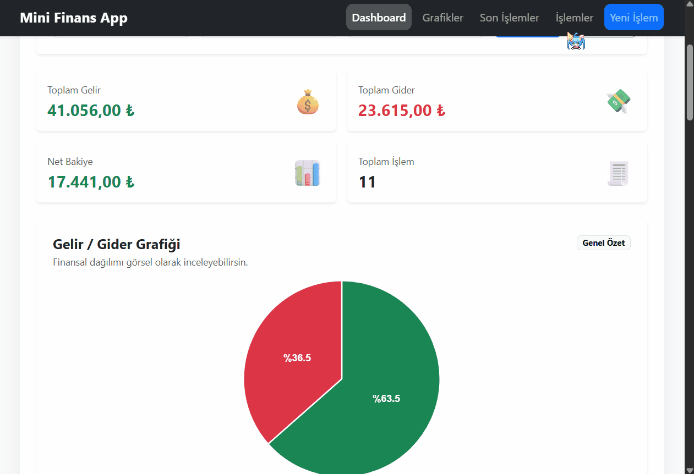
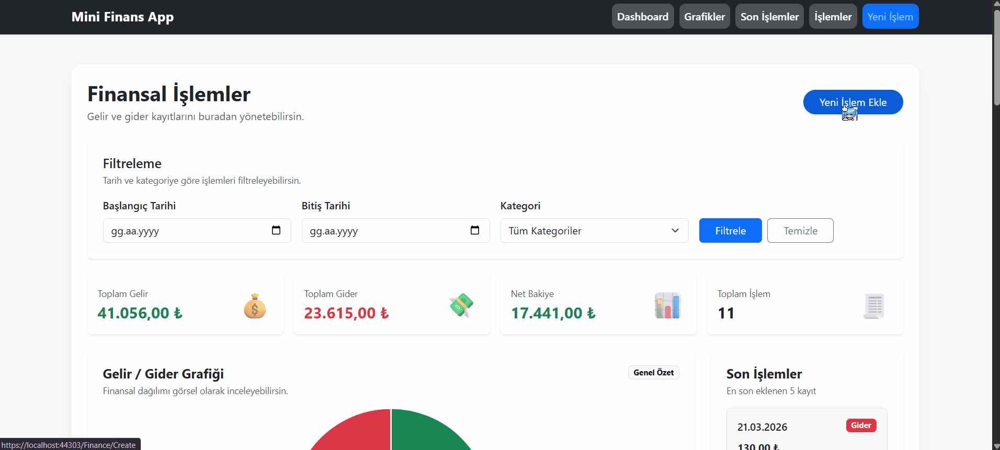
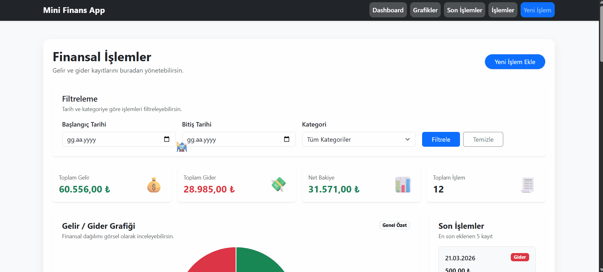

# 💰 Mini Financial Reporting System

A modern and dynamic **financial tracking web application** built with **ASP.NET MVC, Entity Framework, and SQL Server**.

This project enables users to manage income and expense transactions while providing an **interactive dashboard with analytical insights and visual reports**.

---

### 🎬 Demo GIFs

| 📊 Dashboard Overview | 
|----------------------|
|  |

| ➕ Add Transaction |🔍 Filter Flow |
|-------------------|----------------|
|  |  |

---

## ✨ Features

### 💸 Financial Management
- Income & Expense tracking  
- Transaction logging system  
- Category-based expense analysis  
- Date-based filtering system  

### 📊 Dashboard & Analytics
- Real-time financial summary  
- Interactive charts (Chart.js)  
- Financial trend visualization  
- Category-based reporting  

### 🎨 User Experience
- Responsive UI (Bootstrap 5)  
- Clean and modern design  
- Fast and intuitive interaction  

---

## 🛠️ Tech Stack

- ASP.NET MVC (.NET Framework)  
- Entity Framework  
- Microsoft SQL Server  
- Bootstrap 5  
- Chart.js  
- SweetAlert2  
- HTML5 / CSS3  

---

## 📸 Screenshots

### 📊 Dashboard

| Overview | Charts |
|----------|--------|
|  |  |

---

### 💸 Transactions

| Create | Edit |
|--------|------|
|  |  |

| Details | Delete |
|--------|--------|
|  |  |

---

## 🧠 Database Design

> Relational database structure designed for scalable financial tracking


---

## 🚀 Key Highlights

- Real-time financial dashboard with dynamic charts  
- Advanced filtering system (date & category)  
- Clean and scalable relational database design  
- Fast and responsive financial tracking experience  

---

## 🏗️ Architecture

This project follows a **layered MVC architecture**:

### 🧩 Application Layers
- Controllers → Handle HTTP requests and application flow  
- Models → Represent database entities (Entity Framework)  
- Views → Razor-based UI rendering  

### 🗄️ Data Layer
- Entity Framework for ORM and data access  
- Structured relational database (SQL Server)  

---

## 🔄 How It Works

### 🌐 User Flow
1. User interacts with the dashboard  
2. Data is retrieved from SQL Server via Entity Framework  
3. Controllers process requests  
4. Views display dynamic financial data  

---

## ⚙️ Installation

### 1. Clone the repository
```bash
git clone https://github.com/MertcanKayirici/MiniFinansRaporlama.git
```
2. Open the project

 Open the .sln file using Visual Studio

3. Create database

Create a database named:
```plain
MiniFinansDB
```
4. Run SQL script

Execute:
```bash
Database/MiniFinansRaporlama_DB.sql
```
5. Configure connection string

Update your Web.config:
```xml
<connectionStrings>
  <add name="MiniFinansDb"
       connectionString="Data Source=YOUR_SERVER_NAME;Initial Catalog=MiniFinansDB;Integrated Security=True"
       providerName="System.Data.SqlClient" />
</connectionStrings>
```
- ⚠️ Make sure to replace YOUR_SERVER_NAME with your SQL Server instance name.

6. Run the project

- Run the project using **Visual Studio (F5)** 🚀

---

## 📌 Important Notes
- Ensure SQL Server is running
- Update the connection string before running
- Do not share sensitive credentials

---

## 📂 Project Structure
- Controllers   → MVC Controllers  
- Models        → Entity Framework Models  
- Views         → Razor Views  
- Database      → SQL Scripts  
- Screenshots   → Images & GIF files

---

## 👨‍💻 Developer

Mertcan Kayırıcı

Backend-focused Full Stack Developer
ASP.NET MVC & SQL Server

---

## ⭐ Project Purpose

This project was developed to simulate a real-world financial tracking system, focusing on:

- Clean architecture principles
- Data visualization techniques
- User-friendly dashboard design

---
