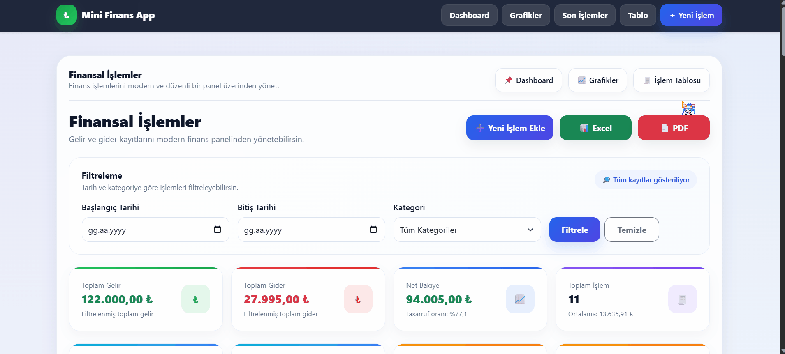

# 💰 Mini Financial Reporting System

<p align="center">
  
  
  
  
  
  
</p>

---

A modern and dynamic **financial tracking web application** built with **ASP.NET MVC, Entity Framework, and SQL Server**.

This project provides a complete system for managing financial transactions with a **modern dashboard, export system, and audit logging**.

---

# 🎬 Demo

| Dashboard |
|------------|
|  |

| Export | Filter |
|--------|--------|
|  |  |

---

# 🔄 UI Evolution (Before vs After)

## 📊 Dashboard

| Before | After |
|--------|------|
|  |  |

---

## 💸 Transaction Pages

| Create | Edit |
|--------|------|
|  |  |

| Details | Delete |
|--------|--------|
|  |  |

---

# ✨ Features

## 💸 Financial Management
- Full CRUD operations (Create, Edit, Delete, Details)
- Managed income & expense transactions with categorized tracking
- Category-based system
- Date-based filtering

---

## 🧩 System Overview

This application follows a classic MVC architecture:

- Controllers handle user requests and business flow
- Models represent the data structure and database relations
- Views provide the user interface using Razor and Bootstrap

The system is designed to be modular, scalable, and easy to maintain.

---

## 🔄 Application Workflow

1. User creates a transaction (income or expense)
2. Data is saved into SQL Server via Entity Framework
3. Dashboard updates automatically with new calculations
4. User can filter data by category or date
5. Reports can be exported as PDF or Excel
6. All actions are logged in the audit system

---

## 📊 Dashboard & Analytics
- Real-time financial summary
- Income / Expense cards
- Category distribution charts
- Chart.js integration
- Monthly financial overview

---

## 📁 Export System (NEW 🚀)
- Export to Excel
- Export to PDF
- Filter-based export
- Clean report formatting

---

## 📝 Audit Log System (NEW 🚀)
- Tracks Create / Update / Delete actions
- Stores timestamps
- Logs user operations
- Improves system transparency

---

## 🎨 UI / UX Improvements (NEW 🚀)
- Redesigned Edit / Create / Details pages
- Modern card-based UI
- Better form usability
- SweetAlert confirmations
- Responsive layout

---

# 📸 Screenshots

| Dashboard |
|----------|
|  |

| Create | Edit |
|--------|------|
|  |  |

| Details |
|--------|
|  |

---

# 🧠 Database Design


---

## 🚀 Key Highlights

- Built a complete financial tracking workflow (CRUD + analytics + reporting)
- Implemented export system (Excel & PDF) for real-world usage
- Designed audit logging system for data transparency
- Developed interactive dashboard using Chart.js
- Focused on clean and scalable architecture

---

## 🎯 Why This Project?

This project was built to simulate a real-world financial management system.

The goal was not only to implement CRUD operations but also to:
- Design a complete data-driven workflow
- Apply reporting and analytics features
- Improve UI/UX with modern design principles
- Build a system that reflects real business needs

---

## 🧠 Challenges & Learnings

- Implementing dynamic filtering with date ranges
- Designing a clean and readable dashboard UI
- Creating export functionality using iText7 and ClosedXML
- Structuring audit logging for tracking user actions

This project significantly improved my understanding of backend architecture and data handling.

---

# 🛠️ Tech Stack

- ASP.NET MVC (.NET Framework)
- Entity Framework
- SQL Server
- Bootstrap 5
- Chart.js
- SweetAlert2
- iText7 (PDF)
- ClosedXML (Excel)

---

# ⚙️ Installation

### 1. Clone the repository

```bash
git clone https://github.com/MertcanKayirici/MiniFinansRaporlama.git
```
### 2. Open the project

Open the `.sln` file using Visual Studio

### 3. Create database

Create a database named:
```plain
MiniFinansDB
```
### 4. Run SQL script

Execute:
```bash
Database/MiniFinansRaporlama_DB.sql
```
### 5. Configure connection string

Update your Web.config:
```xml
<connectionStrings>
  <add name="MiniFinansDb"
       connectionString="Data Source=YOUR_SERVER_NAME;Initial Catalog=MiniFinansDB;Integrated Security=True"
       providerName="System.Data.SqlClient" />
</connectionStrings>
```
> ⚠️ Make sure to replace `YOUR_SERVER_NAME` with your SQL Server instance name.

### 6. Run the project

Run the project using **Visual Studio (F5)** 🚀

---

## 📌 Important Notes
- Ensure SQL Server is running
- Update the connection string before running
- Do not share sensitive credentials

---

## 📂 Project Structure
Controllers → Handles HTTP requests and application flow
Models → Entity Framework models and database structure
Views → Razor-based UI components  
Database → SQL scripts and database setup
Screenshots → Images and demo assets

---

## 👨‍💻 Developer

**Mertcan Kayırıcı**  
Backend-focused Full Stack Developer  

🔗 GitHub: https://github.com/MertcanKayirici  
🔗 LinkedIn: https://www.linkedin.com/in/mertcankayirici

---

## ⭐ Project Purpose

This project was designed as a portfolio piece to demonstrate backend development skills and real-world system design.

---

## 🚀 Future Improvements

- API-based architecture (ASP.NET Core Web API)
- AJAX-based real-time updates
- Role-based authentication system
- Advanced financial analytics

---
